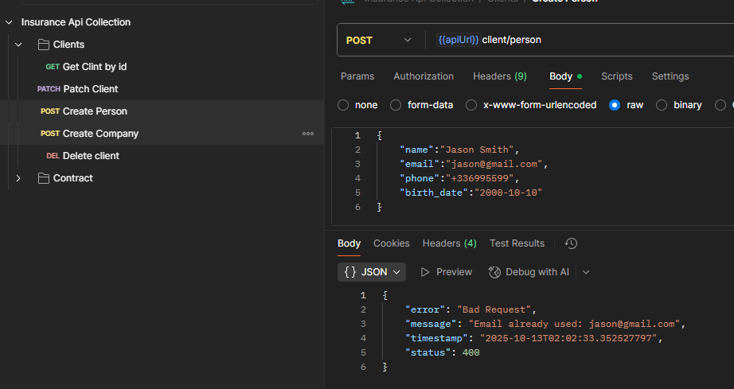
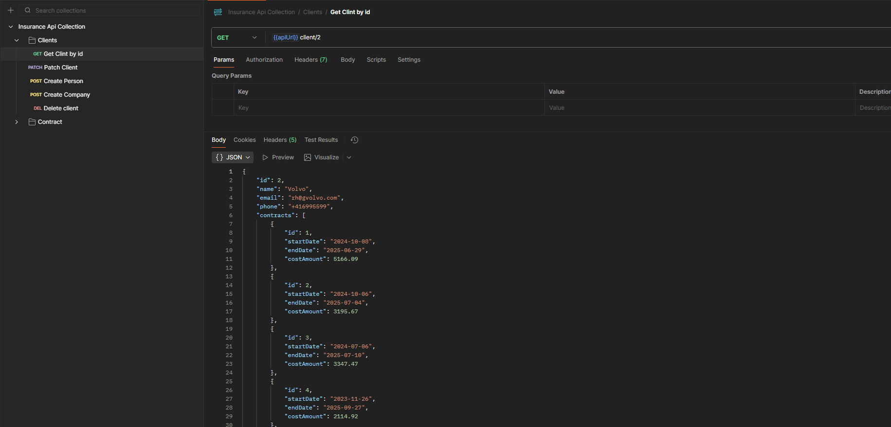
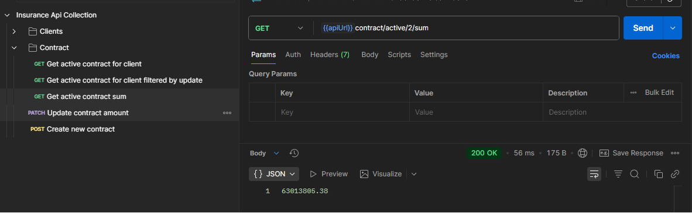
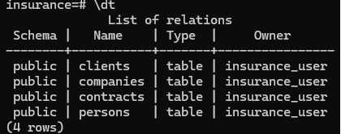
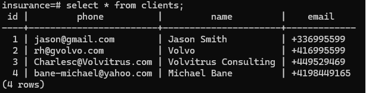
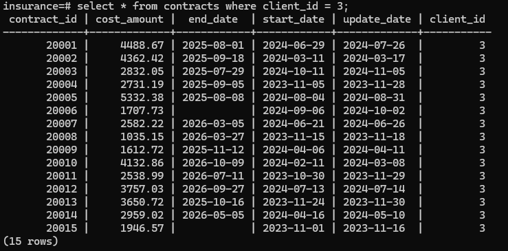

# Insurance API Project

---

# I. Architecture & Design

The application is built with:

* **Java 21**, **Spring Boot**, **Maven**, and **PostgreSQL**
* **Layered architecture**

## Entity

* `Client` is the base entity, with `Person` and `Company` inheriting from it.
* `Contract` entities are associated with clients but are designed to be orphaned if the client is deleted.
* Emails and phone numbers must be **unique**.
* The **company identifier** is **automatically generated** using a utility class.

## Validation

* Emails: validated with **regex**.
* Phone numbers: must include a **country code** (e.g. `+41`).
* Amounts: must be **positive** with a **maximum of two decimals**.
* Dates: validated in **ISO 8601** format.
* Currency formatting is intentionally not enforced for flexibility.

## Performance

* **Database indexes** are used to optimize contract aggregation queries.

## Database Persistence

* Data is stored in PostgreSQL using a Docker volume to ensure it **persists even if the application crashes or is restarted**.

---

# II. Running Locally

**Requirements before running:**

* All required ports (5432 for PostgreSQL, 8080 for the API) must be free.
* **Docker** and **Docker Compose** must be installed on the computer.
* **Postman** is optional but recommended to test the API. A **Postman collection** is available in the repository and contains requests for both the **local** and **dist** environments.
* Most tests were performed on **Windows 11**, but the project also works on Linux distributions like Ubuntu (you may need to use `chmod` on some files or adjust file permissions).

To run the project on my machine, I just:

```bash
git clone https://github.com/Irilind-Salihi/insurance-api.git
cd .\insurance-api\
docker compose up --build -d
```

* This builds and starts both the **PostgreSQL database** and the **Spring Boot API** in containers.
* The API is available at `http://localhost:8080`.
* The `-d` flag runs the containers in **detached mode**, so they run in the background.

When I’m done, I can stop everything with:

```bash
docker-compose down
```

This approach meets the requirement that the project can be run locally easily without additional setup.

---

# III. Proof the API Works

The project is constantly running on a server and is fully reachable using the **Postman collection** (available in the repository) in the `dist` environment. The collection is set up to execute every API request, covering all functionality.

### Example API Requests

Here are three example endpoints with screenshots from the Postman collection:

1. **Create a Person**

   

2. **Get a client by its id**

   

3. **Get Sum of Active Contract Costs**
   

These examples demonstrate that the API works for creating a person, returning client info, and performing aggregation queries.

---

### Test Dataset

The project includes an **auto-generated dataset** with 4 users:

* 1 empty user
* 1 user with 4,000 inactive contracts and 16,000 active contracts
* 1 user with 15 contracts
* 1 user with 45 contracts

Screenshots of example database queries in PostgreSQL:

1. **Query All Tables**

   

2. **Query All Client**

   

3. **Query All Contracts for a Client**

   

These screenshots show the dataset structure and verify that the queries used by the API return the expected results, even with large datasets.

---

Additionally, a **Swagger UI** is available at [http://localhost:8080/swagger-ui/index.html#/](http://localhost:8080/swagger-ui/index.html#/) (when project running), showing required fields for each request.

Finally, I implemented **unit tests** to validate key service and repository logic, ensuring the API behaves consistently with the application requirements.
